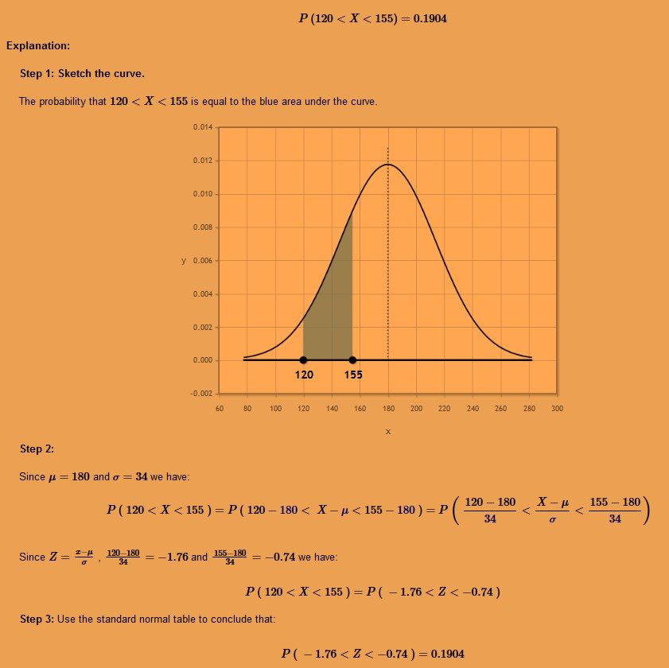
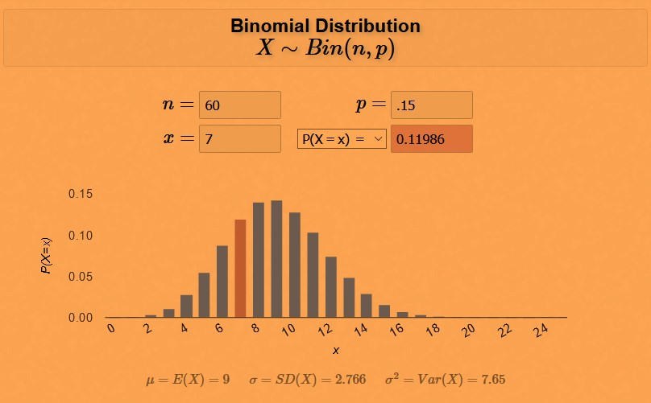

# About

This folder is about using OOP, inheritence, and modularizing code. 

Gaussian inherts from GenDistribution.

# Installing Packages & Preparing Packages for Distributoin
Start with [this section](https://classroom.udacity.com/courses/ud090/lessons/55951aa6-a28f-4642-a9b4-f9ea92a825ec/concepts/0f6e02e6-13bd-498c-9297-1afdef89e909) - I did not include examples in repo. 

A package is a collection of Python modules. Although the previous code might already seem like it was a Python package because it contained multiple files, a Python package also needs an __init__.py file. 

Pip is a Python package manager that helps with installing and uninstalling Python packages. Pip can also be used to install a Python package from a local folder on your computer. These packages can be uploaded to [PyPi](https://pypi.org/) repository to be shared with the world. Instructions for uploading [starts here](https://classroom.udacity.com/courses/ud090/lessons/55951aa6-a28f-4642-a9b4-f9ea92a825ec/concepts/2b79b827-2756-41bb-9b43-fe3430b6d7d8).

Completed files @ [binomial_package](binomial_package/setup.py) copied from course for reference

### Notes on Conda
(Did not install Conda on computer: Conda is an environment manager (and a package manager) that allows you to create silo-ed Python installations; can install packages on your computer without affecting your main Python installation.)

If you create a conda environment, activate the environment, and then pip install the distributions package, you'll find that the system installs your package globally rather than in your local conda environment. However, if you create the conda environment and install pip simultaneously, you'll find that pip behaves as expected installing packages into your local environment.

# Resources

- [Decorators](https://realpython.com/primer-on-python-decorators/)
- [Mixins](https://easyaspython.com/mixins-for-fun-and-profit-cb9962760556)

# Distribution Formulas

Assume the average weight of an American adult male is 180 pounds with a standard deviation of 34 pounds. The distribution of weights follows a normal distribution. What is the probability that a man weighs somewhere between 120 and 155 pounds?

Consider a Binomial distribution. Assume that 15% of the population is allergic to cats. If you randomly select 60 people for a medical trial, what is the probability that 7 of those people are allergic to cats?

