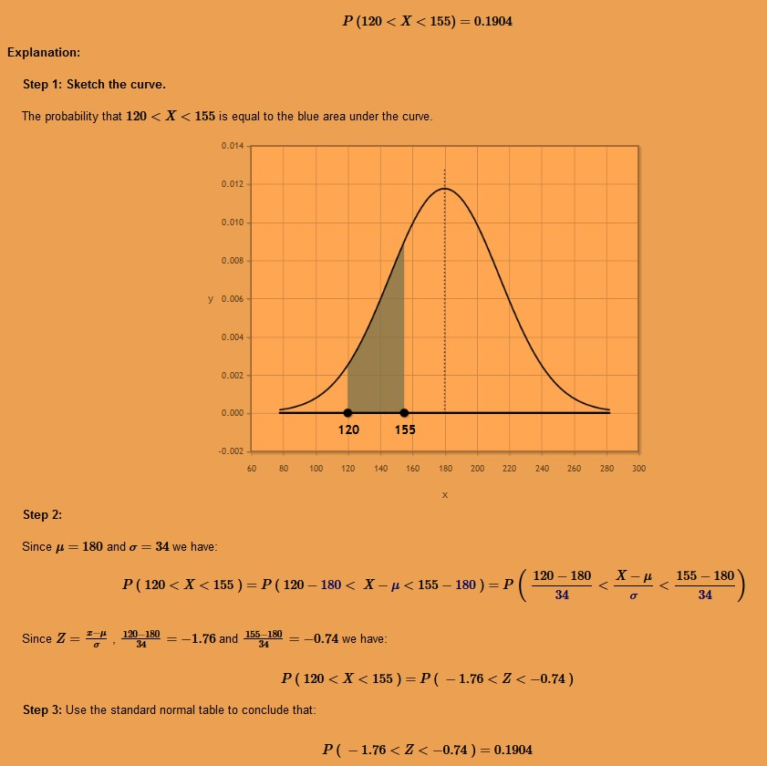

# Stats

Assume the average weight of an American adult male is 180 pounds with a standard deviation of 34 pounds. The distribution of weights follows a normal distribution. What is the probability that a man weighs somewhere between 120 and 155 pounds?

Consider a Binomial distribution. Assume that 15% of the population is allergic to cats. If you randomly select 60 people for a medical trial, what is the probability that 7 of those people are allergic to cats?

